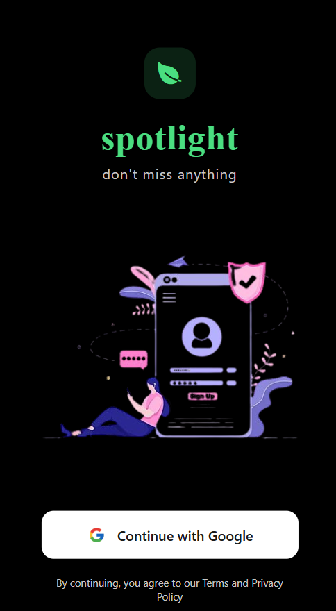
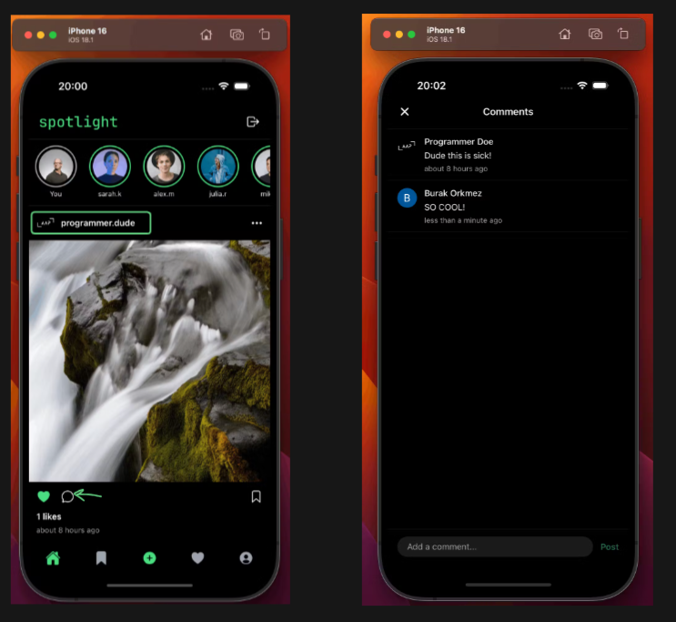
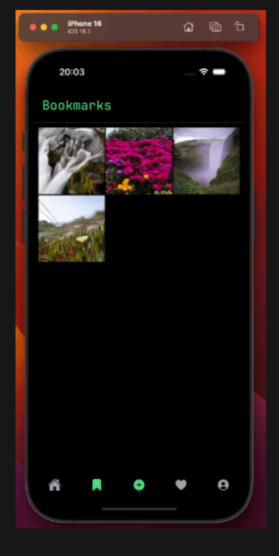
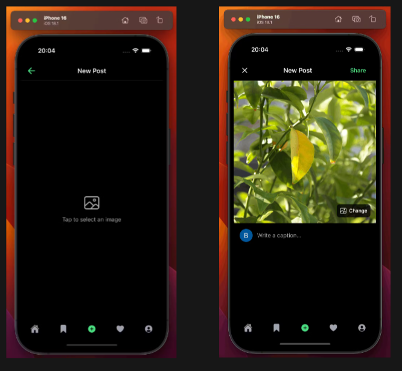
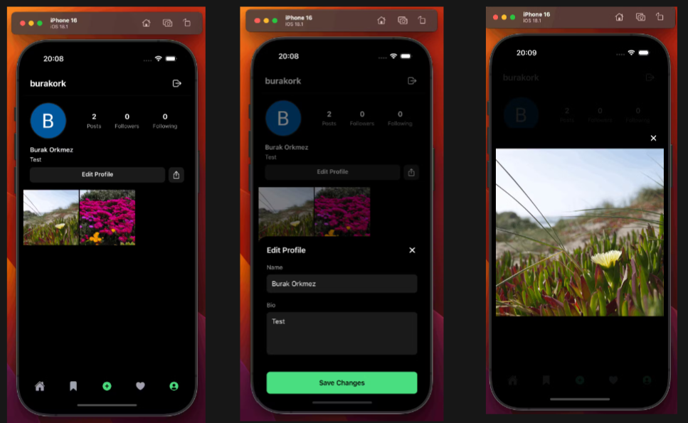
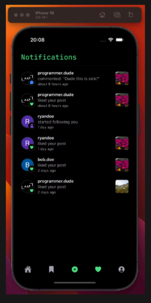

# 🌟 Spotlight - Social Media App

<div align="center">
  
  <h3>Don't miss anything</h3>
</div>

## 📱 Overview

Spotlight est une application mobile moderne qui permet aux utilisateurs de partager des moments à travers des photos et de se connecter avec d'autres utilisateurs. Elle est construite avec les dernières technologies et offre une expérience utilisateur fluide et moderne.

## ✨ Caractéristiques principales

- 🔐 **Authentification sécurisée**
  - Connexion avec Google via Clerk
  - Protection des routes
  - Gestion des sessions

- 📸 **Fonctionnalités sociales**
  - Partage de photos avec légendes
  - Système de likes et commentaires
  - Stories utilisateur
  - Sauvegarde de posts favoris

- 👥 **Profils utilisateur**
  - Profils personnalisables
  - Système de follow/unfollow
  - Compteurs de followers et following
  - Grille de posts

- 🔔 **Notifications en temps réel**
  - Likes, commentaires et nouveaux followers
  - Mises à jour instantanées

## 🛠️ Stack technique

- **Frontend**
  - [Expo](https://expo.dev/) - Framework React Native
  - [React Native](https://reactnative.dev/) - UI native
  - [Expo Router](https://docs.expo.dev/routing/introduction/) - Navigation

- **Backend & Auth**
  - [Clerk](https://clerk.com/) - Authentification & Gestion utilisateurs
  - [Convex](https://www.convex.dev/) - Backend temps réel
  - [Svix](https://www.svix.com/) - Webhooks sécurisés

## 🎥 Démonstration interactive

### Navigation et fonctionnalités

<div style="display: flex; flex-direction: column; gap: 20px;">
  <div>
    <h4>🚀 Flux principal et interactions</h4>
    <div style="display: flex; gap: 10px;">
      
      
      
    </div>
    <p>👆 La navigation commence par une connexion sécurisée, suivie du feed principal avec des interactions en temps réel pour les likes et commentaires.</p>
  </div>

  <div>
    <h4>📸 Création et gestion de contenu</h4>
    <div style="display: flex; gap: 10px;">
      
      
      
    </div>
    <p>👆 Créez et partagez du contenu facilement, recevez des notifications instantanées et sauvegardez vos posts préférés.</p>
  </div>
</div>

### ✨ Caractéristiques interactives

- **Double tap** sur une image pour liker
- **Glissez vers le bas** pour rafraîchir le feed
- **Appui long** sur un post pour le sauvegarder
- **Balayez** les stories pour naviguer
- **Pincement** sur les images pour zoomer

## 🚀 Installation

1. **Cloner le repo**
```bash
git clone https://github.com/votre-username/spotlight-app.git
cd spotlight-app
```

2. **Installer les dépendances**
```bash
npm install
```

3. **Configuration des variables d'environnement**
```bash
cp .env.example .env
```
Remplir les variables suivantes :
- EXPO_PUBLIC_CLERK_PUBLISHABLE_KEY
- CONVEX_DEPLOYMENT
- EXPO_PUBLIC_CONVEX_URL

4. **Lancer l'application**
```bash
npm start
```

## 📖 Documentation

### 🎓 Guide d'apprentissage

Nous avons créé un [tutoriel complet](docs/tutorial.md) qui vous guidera à travers toutes les fonctionnalités de l'application :
- Configuration initiale
- Flux de navigation interactif
- Exemples de code détaillés
- Guides de personnalisation
- Dépannage et astuces

### 🔄 Interaction entre les pages

L'application est construite avec une architecture temps réel qui permet une interaction fluide entre les différentes pages :

1. **Feed → Profil**
   - Cliquez sur un avatar pour accéder au profil
   - Les statistiques se mettent à jour en temps réel
   - Système de follow/unfollow instantané

2. **Posts → Commentaires**
   - Interface de commentaires en temps réel
   - Notifications instantanées
   - Compteurs de likes synchronisés

3. **Stories → Visionneuse**
   - Navigation fluide entre les stories
   - Indicateurs de progression
   - Interactions rapides (like, partage)

### 📚 Documentation technique

Pour des informations détaillées sur l'implémentation :
- [Guide d'authentification Clerk](docs/clerk-guide.html)
- [Intégration Convex](docs/demo-clerk-convex.html)
- [Structure des pages](docs/explication-pages.html)
- [Layout initial](docs/explication-initial-layout.html)

## 🤝 Contribution

Les contributions sont les bienvenues ! N'hésitez pas à :
1. Fork le projet
2. Créer une branche (`git checkout -b feature/amazing-feature`)
3. Commit vos changements (`git commit -m 'feat: add amazing feature'`)
4. Push sur la branche (`git push origin feature/amazing-feature`)
5. Ouvrir une Pull Request

## 📄 Licence

Ce projet est sous licence MIT. Voir le fichier [LICENSE](LICENSE) pour plus de détails.

## 🙏 Remerciements

- [Clerk](https://clerk.com/) pour l'authentification
- [Convex](https://www.convex.dev/) pour le backend
- [Expo](https://expo.dev/) pour le framework