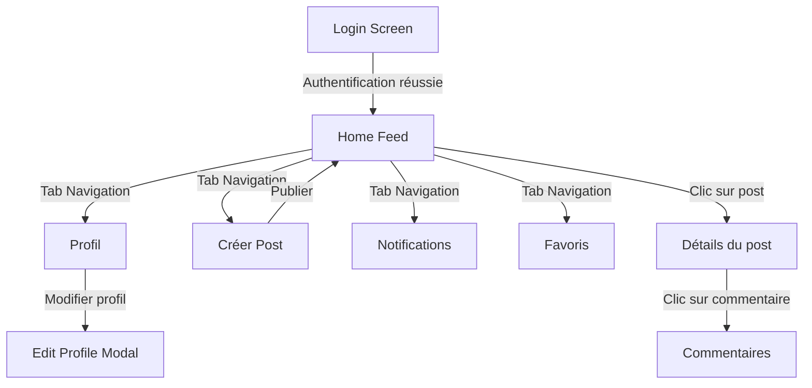

# 📚 Guide complet de Spotlight

## 🚀 Démarrage rapide

### Installation et configuration

1. **Prérequis**
```bash
# Installer Node.js et npm
node -v  # Vérifier l'installation (v16+ recommandé)
npm -v   # Vérifier npm

# Installer Expo CLI
npm install -g expo-cli
```

2. **Configuration de Clerk**
- Créer un compte sur [Clerk](https://clerk.com)
- Créer une nouvelle application
- Activer l'authentification Google
- Copier les clés API

3. **Configuration de Convex**
- Créer un compte sur [Convex](https://convex.dev)
- Créer un nouveau projet
- Copier l'URL de déploiement

### 🔄 Flux de navigation



## 📱 Guide des fonctionnalités

### 1. Authentification (login.tsx)
- Connexion avec Google via Clerk
- Redirection automatique vers le flux principal
- Gestion des sessions persistantes

### 2. Flux principal (index.tsx)
```typescript
// Exemple d'interaction avec un post
const handleLikePress = async (postId) => {
  await toggleLike({ postId });
  // La mise à jour est automatique grâce à Convex
};

// Exemple de partage
const handleShare = async (post) => {
  const shareUrl = `spotlight://post/${post._id}`;
  await Share.share({ url: shareUrl });
};
```

### 3. Création de post (create.tsx)
- Sélection d'image depuis la galerie
- Prévisualisation en temps réel
- Upload automatique vers Convex
- Mise à jour instantanée du feed

### 4. Profil utilisateur (profile.tsx)
```typescript
// Exemple de mise à jour du profil
const updateProfile = async ({ name, bio }) => {
  await mutations.profile.update({
    name,
    bio,
    // La mise à jour est reflétée en temps réel
  });
};
```

### 5. Système de notifications
- Types de notifications :
  - Likes
  - Commentaires
  - Nouveaux followers
- Mise à jour en temps réel avec Convex

## 🔧 Personnalisation

### Thème (theme.ts)
```typescript
export const COLORS = {
  primary: '#00FF94',
  background: '#000000',
  surface: '#1A1A1A',
  // ... autres couleurs
};
```

### Composants personnalisés
- InitialLayout : Gestion de l'état d'authentification
- ClerkConvexProvider : Intégration Clerk et Convex

## 🛠️ Dépannage

### Problèmes courants

1. **Erreur de connexion**
```bash
# Vérifier les variables d'environnement
cat .env
# Vérifier la connexion à Clerk/Convex
npx convex dashboard
```

2. **Problèmes d'image**
```bash
# Nettoyer le cache Expo
expo r -c
```

### Astuces de développement

1. **Mode développement**
```bash
# Lancer avec outils de debug
npm run dev
```

2. **Tests**
```bash
# Lancer les tests
npm test
```

## 📡 Architecture temps réel

### Convex Queries
```typescript
// Exemple de query en temps réel
const posts = useQuery(api.posts.list);
// Mise à jour automatique quand les données changent
```

### Webhooks Clerk
```typescript
// Exemple de traitement webhook
export const handleClerkWebhook = webhook({
  async onUserCreated(event) {
    // Créer l'utilisateur dans Convex
  }
});
```

## 🎨 Styles et Thèmes

### Composants réutilisables
```typescript
// Exemple de bouton personnalisé
export const PrimaryButton = ({ onPress, children }) => (
  <TouchableOpacity 
    style={styles.button}
    onPress={onPress}
  >
    <Text style={styles.buttonText}>{children}</Text>
  </TouchableOpacity>
);
```

### Animation et interaction
```typescript
// Exemple d'animation de like
const scale = useSpring(1);
const handleLike = () => {
  scale.value = withSpring(1.2, {}, () => {
    scale.value = 1;
  });
};
```
